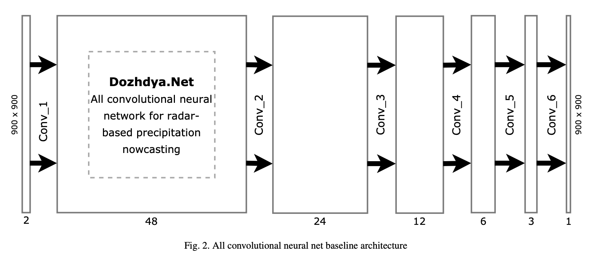

# All convolutional neural networks for radar-based precipitation nowcasting

[Paper PDF](https://www.researchgate.net/publication/332308054_All_convolutional_neural_networks_for_radar-based_precipitation_nowcasting)

G. Ayzela,b,∗
, M. Heistermanna
, A. Sorokinc
, O. Nikitinc
, O. Lukyanovac

## Motivation

---

- This study focuses the particular importance of selecting and adopting suitable data preprocessing routine, netwotk structure, and loss function regarding input data features, and as a result, highlights limited transferability of methods in existing studies.
- This paper aims to provide a simplified and transparent approach to developing a research workflow around a precipitation nowcasting problem based on using deep learning models.

## Method

---

- Using data of RY product of the German Weather Service (DWD) as input to our nowcasting models.
  - Cover 900km x 900km area.
  - 1 x 1 km and 5 min spatial and tempral resolution.
- Use 4 transformation process to feed data to DNN
  - threshold value = 1, normalization constant = 0.5
  - threshold value = 0.5, normalization constant = 0.25
  - log(x+1)
  - log(x + 0.01)
- model archtecuture
  - 
  - Loss functions
    - MAE
    - MSE
    - Logcosh
  - Optimizer
    - Adam

## Insight

---

- log(x + 0.01) preprocess was better predidction score.
- Logcosh was better prediction socre.
- Smaller kernel was better results and bigger kernel size causes overfitting and increasing uncertainty of predictions.

## Contribution Summary

---

## Keyword

---

- wradlib: An Open Source Library for Weather Radar Data Processing.
- h5py: The h5py package is a Pythonic interface to the HDF5 binary data format. HDF5 lets you store huge amounts of numerical data, and easily manipulate that data from NumPy.

## Unknown

---

## Reflection

---

## Reference

---

- Foresti, L., Reyniers, M., Seed, A., Delobbe, L.. Development and verification of a real-time stochastic precipitation nowcasting system for urban hydrology in belgium. Hydrology and Earth System Sciences 2016;20(1):505–527. URL: <https://www.hydrol-earth-syst-sci.net/20/505/2016/>. doi:10.5194/hess-20-505-2016.
- Bowler, N.E., Pierce, C.E., Seed, A.W.. Steps: A probabilistic precipitation forecasting scheme which merges an extrapolation nowcast with downscaled nwp. Quarterly Journal of the Royal Meteorological Society 2006;132(620):2127–2155.
- Shi, X., Gao, Z., Lausen, L., Wang, H., Yeung, D.Y., Wong, W.k., et al. Deep Learning for Precipitation Nowcasting: A Benchmark and A New Model 2017;URL: <http://arxiv.org/abs/1706.03458>.
