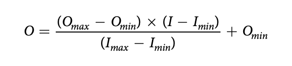
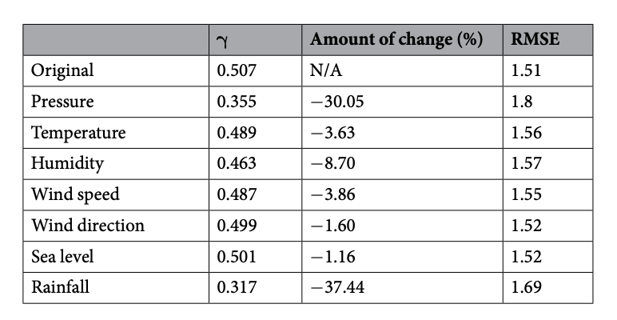

# Application of the deep learning for the prediction of rainfall in Southern Taiwan

[Paper PDF](https://www.nature.com/articles/s41598-019-49242-6)

- authors
  - Meng-HuaYen1, Ding-Wei Liu2, Yi-Chia Hsin3, Chu-En Lin4 & Chii-ChangChen2
    1. Department of Electronic Engineering, National Chin-Yi University of Technology, 411, Taichung Taiwan.
    2. Department of Optics and Photonics, National Central University, 320, Taoyuan, Taiwan.
    3. Research Center for Environmental Changes, Academia Sinica, 115, Taipei, Taiwan.
    4. Lordwin Technology Inc., 804, Kaohsiung, Taiwan. Correspondence and requests for materials should be addressed to C.-C.C
- journal
  - nature scientific report

## Motivation

---

- The main purpose of this study is to develop a forecasting model od rainfall using RC and to investigate the possible factors in governing the rainfall forecast in the southern Taiwan. to the best of our knowlidge, this is the first study that rainfall is forecasted by using RC. In summary, we present the direct evidence for the system performance and the effect to rainfall prediction.

## Method

---

- calculate RMSE, Normalized RMSE, correlation coefficient from the observed precipitation and the predicted value.
- Compare with the commercial software (MATLAB) models to verify their models' feasibility.
- Calculate metrics such that probability of detection (POD), false alarm ratio (FAR) and threat score (TS).
- Data of two observation stations including seven parameters.
  - air pressure
  - humidity
  - wind speed
  - wind direction
  - precipitation
  - sea level
- To find out the dominant factors controlling the rainfall prediction, they used PCA and a method of the parameter adjustment (i.e, alternatively taking an input paramater off).
  - Turning off a parameter wach time by adjusting the parameter to the extreme value (+1 in this study) of the mapminmax standarization as the manipulation of the cause, the remaining six parameters as a contorol change. If the change (CC score for test dataset) is bigger, the parameter is likely a dominant factor.
- Since the values of the meteorological parameters used in this study are more concentrated, the normalization method used in this study is standardized for mapminmax.
  - 

## Insight

---

- DeepESN had better score.
- Pressure Humidity, Rainfall are dominant factors.
  - 
- They reduced the input parameters to 3, and the score got improved.

## Contribution Summary

---

## Keyword

---

- Reservoir Computiong: is a framework for computation derived from reccurent neural nerwork theory that maps input signals into higher dimentional computational spaces through the dynamics of a fixed, non-linear system called a reservoir.
- Echo state network (ESN)
- Deep Echo state network (DeepESN)

## Unknown

---

## Reflection

---

## Reference

---

- Chen, C.-S. & Chen, Y.-L. Te rainfall characteristics of Taiwan. Monthly Weather Review 131, 1323–1341 (2003)
- Chen, C.-S., Chen, Y.-L., Liu, C.-L., Lin, P.-L. & Chen, W.-C. Statistics of heavy rainfall occurrences in Taiwan. Weather and Forecasting 22, 981–1002 (2007).
- Richardson, L. F. Weather prediction by numerical process. (Cambridge University Press, 2007)
- Hashim, R. et al. Selection of meteorological parameters afecting rainfall estimation using neuro-fuzzy computing methodology. Atmospheric Research 171, 21–30 (2016).
- Gallicchio, C. & Micheli, A. Deep echo state network (deepesn): A brief survey. arXiv preprint arXiv:1712 04323 (2017).
- Gallicchio, C., Micheli, A. & Pedrelli, L. Design of deep echo state networks. Neural Networks 108, 33–47 <https://doi.org/>
- Granata, F., Gargano, R. & De Marinis, G. Support Vector Regression for Rainfall-Runoff Modeling in Urban Drainage: A Comparison with the EPA’s Storm Water Management Model. Water-Sui 8, 69 (2016).
