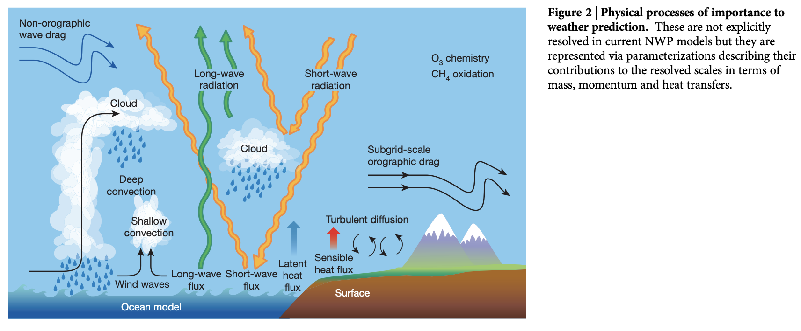
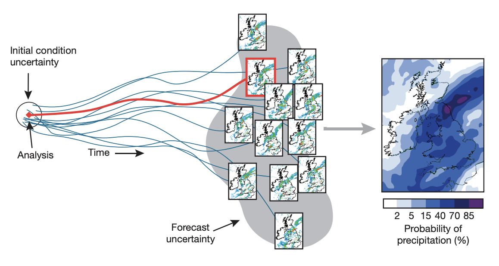

# The quiet revolution of numerical weather prediction

Peter Bauer1, Alan Thorpe1 & Gilbert Brunet2

[Paper PDF](https://www.researchgate.net/publication/281516336_The_quiet_revolution_of_numerical_weather_prediction/link/56dc3b8008aee1aa5f873b9c/download)

(This is a research paper.)

## Motivation

---

- This review explains the fundamental scientific basis of numerical weather prediction (NWP) before highligting three areas from which the largest benefit in predictive skill has been obtained in the past physical process representation, ensemble forecasting and model initialization.

- The forecasts of nonlinear systems can vastly  differ if small perturbations are applied to the initial conditions, and that this dificult cloud be fundamental in limiting predictive skill. In the 1950s, Thompson performed one of the first quantitative estimates of initial errors growing during the forecast.

## Method

---

- Ensemble approach is a good way to calculate uncertanty if the initial state.

## Insight

---

- Prediction skill of NWP improves at a rate such that usefull skill is retained one more day into the forecast range for every decade of research and development.
- High resolutions are not yet in reach, convection parameterizations will remain crutial for gloabl weather and clumate modeling for the next decade and progress in this area require joint efforts in the weather and climate communities.
- To model the uncertainties, stocastic approach may be better way such as stochastic sampling of parameter probability sidtribution functions, stocastically driven sub-cell models, or super-parametarizations.
- More physical as well as chemical processes will be added such as coupling in the very short time scale.

## Contribution Summary

---

## Keyword

---

## Unknown

---

## Reflection

---

## Reference

---
