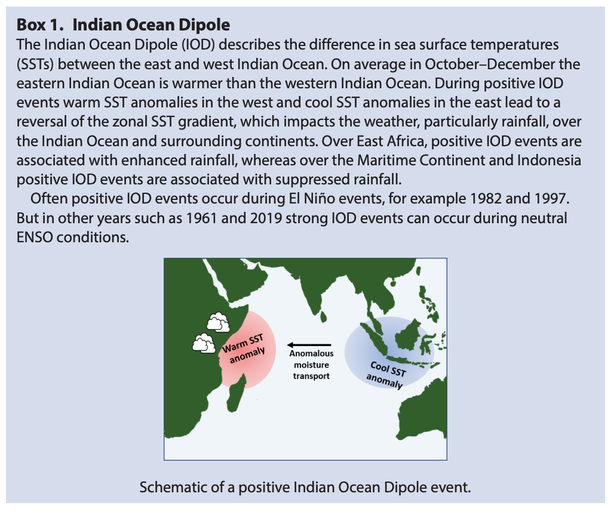

# Extreme rainfall in East Africa, October 2019–January 2020 and context under future climate change

[Paper PDF](https://rmets.onlinelibrary.wiley.com/doi/abs/10.1002/wea.3824)

Caroline M. Wainwright, Declan L. Finney, Mary Kilavi, Emily Black and John H. Marsham, Department of Meteorology, U

## Motivation

---

- To understand the changes of rainfall pattern around east africa and other methodological parameters.

## Method

---

## Insight

---

- The anomalously wet conditions continued after the normal end of the short rains in December into January 2020. The may be related to the persistence of the warm SST anomaly in the western Indian Ocean. The warm SST anomaly in the western Indian Ocean persisted throughout January 2020.
- Future projections from climate models indicate increasing raindall during the short rains under future climate (Rowell et al., 2015), suggesting that events such as the increased rainfall during the 2019 short rains could become more frequent under climate change.
- Furthermore, recent work has shown that climate change can also increase the intensity if rain in storms over Africa because global warming increases the saturation vapour pressure and so potentially the total column water and storm intensities (Kendon et al. 2019; Fenny et al., 2020).
- Cai et al. (2018) concluded that under a global average warming of 1.5 degC (above pre-industrial level) strongly positive IOD events may occur twicw as often.
- The rate of recent warming of the western Indian Ocean is one of the fastest of any tropical ocean over the last century (Roxy et al., 2014) and climate models project that contnuation of these higher rates of warming should be expected under climate change (Zeng et al., 2013, Chu et al., 2014).

## Contribution Summary

---

## Keyword

---

- SST: sea surface temperature
- IOD: Indian Ocean Dipole
  - 
- Dipole: 双極子
- OND: October - December

## Unknown

---

## Reflection

---

## Reference

---

- Rowell DP, Booth BB, Nicholson SE et al. 2015. Reconciling past and future rainfall trends over East Africa. J. Climate 28(24): 9768–9788.
- Kendon EJ, Stratton RA, Tucker S et al. 2019. Enhanced future changes in wet and dry extremes over Africa at convectionpermitting scale. Nat. Commun. 10(1): 1–14
- Finney DL, Marsham JH, Rowell DP et al. 2020. Effects of explicit convection on future projections of mesoscale circulations, rainfall and rainfall extremes over Eastern Africa. J. Climate 33: 2701–2718
- Cai W, Wang G, Gan B et al. 2018. Stabilised frequency of extreme positive Indian Ocean Dipole under 1.5 °C warming. Nat. Commun. 9(1): 1419.
- Roxy MK, Ritika K, Terray P et al. 2014. The curious case of Indian Ocean warming. J. Climate 27(22): 8501–8509.
- Zheng XT, Xie SP, Du Y et al. 2013. Indian Ocean dipole response to global warming in the CMIP5 multimodel ensemble. J. Climate 26(16): 6067–6080
- Chu JE, Ha KJ, Lee JY et al. 2014. Future change of the Indian Ocean basin-wide and dipole modes in the CMIP5. Climate Dynam. 43(1–2): 535–551.
