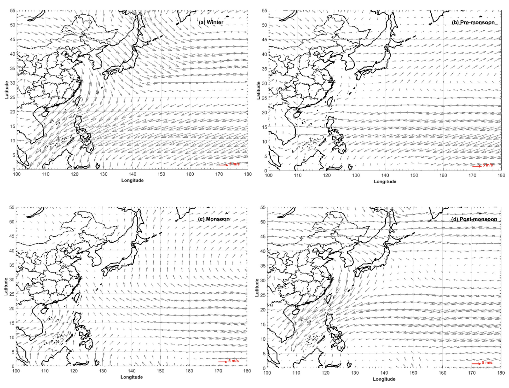

# Lightning climatology over the northwest Pacific region: An 11-year study using data from the World Wide Lightning Location Network

[Paper PDF](https://www.sciencedirect.com/science/article/pii/S0169809517311110?via%3Dihub)

- authors
  - Wenjuan Zhang(1),
      Yijun Zhang(2),
      Dong Zheng(1),
      Liangtao Xu(1),
      Weitao Lyu(1)
- journal
  - (1) a State Key Laboratory of Severe Weather, Chinese Academy of Meteorological Sciences, Beijing, China
  - (2)Institute of Atmospheric Sciences, Fudan University, Shanghai, China

## Motivation

---

- The northwest Pacific region is also the most active TC basin globally, and experiences the largest number of intense tropical storms. Moreover, the northwest Pacific region is an El Nino Southern Oscillation ENSO-sensitive area, which is indicated by the great contrast in convection between the El Nino and La Nina events.
- Investigation of lighting climatology over the nerthwest Pacific region could help to improve our understanding of the occurence and variability of intense convections and thunderstorms in the region.

## Method

---

- Data
  - The ligntning data covered the period 2005-2015 were extracted from the WWLLN database.
  - TC best-track data were used to define TC lightning and quantifythe contribution of TC lightning of TC lightning to the total amount of lightning occurring in the domain. The best-track data were obtained from the Shanghai Typhoon Institute of the China Meteorological Administration.
  - Precipitation data from 2005 to 2015 were derived from the TRMM 3B42 dataset.

## Insight

---

- The land areas show much higher LDs than the oceanic areas. The father away from the continentm, the weaker was the lightning activity over the ocean.
- Seasonal distribution of LDs
  - 
- Seasonal distributuon of Winds
  - 
- Monthly precipitation and the number of lightnings.
  - 
- The number of lightnings increased when El Nino occured and decreased when La nina occured.
- Annomaly of winds when El Nino and La Nina.
  - 

## Contribution Summary

---

## Keyword

---

- LDs: Lightning densityies
- SCS: South China Seas
- SST: Sea Surface temperature
- WWLLN: World Wide Lightning Location Network

## Unknown

---

## Reflection

---

## Reference

---

- (Venugopal et al., 2016)
- 