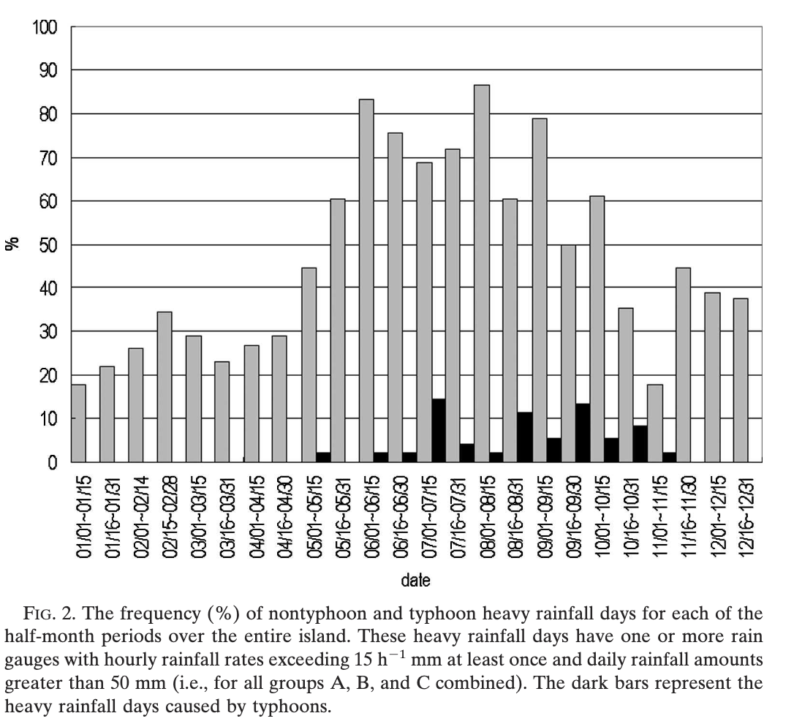
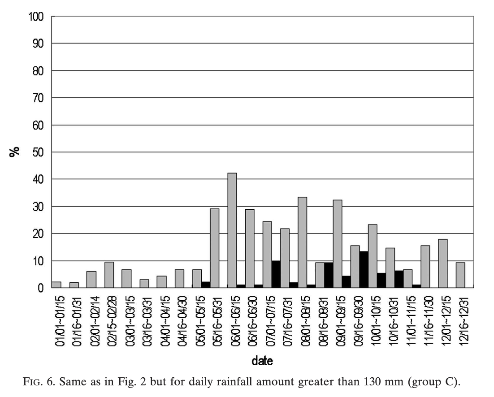

# Statistics of Heavy Rainfall Occurrences in Taiwan

[Paper PDF](https://journals.ametsoc.org/view/journals/wefo/22/5/waf1033_1.xml?tab_body=pdf)

- authors
  - CHING-SENCHEN
    - Institute of Atmospheric Physics, National Central University, Chung-Li, Taiwan
  - YI-LENGCHEN
    - Department of Meteorology, University of Hawaii at Manoa, Honolulu, Hawaii
  - CHE-LINGLIU,PAY-LIAMLIN,ANDWAN-CHINCHEN
    - Institute of Atmospheric Physics, National Central University, Chung-Li, Taiwan
- journal
  - AMS

## Motivation

---

- he study of the heavy rainfallstatistics for the entire island of Taiwan during the mei-yu season and other rainfall regimes is lacking.
- Compilingseasonal and spatial variations of heavy rainfall eventsin Taiwan would provide forecasters with valuable in-formation  on  the  likelihood  that  heavy  rainfall  mightoccur at a given location for different rainfall regimes(Brooks and Stensrud 2000; Schumacher and Johnson2006) and on the regions that are more vulnerable thanothers to flash flooding and landslides (M.-L. Lin et al.2002) at a particular time of the year.

## Method

---

- To  adopt  the  criteria  of  heavyrainfall  (50 mm/day)  used  by  the  forecasters  of  theCentral Weather Bureau (CWB) of Taiwan, to considerthe  potential  threat  of  large  rainfall  accumulation(130mm/day) for landslides (M.-L. Lin et al. 2002)
- daily rainfall ac-cumulations of 50–90, 90–130, and exceeding 130 mm,respectively (Wang et al. 1985)
- In this study, if the center of the typhoon (fromthe report from the CWB) is within 3°latitude or lon-gitude of Taiwan, the rainfall is designated as typhoonrainfall. 

## Insight

---

- Non-typhoon and typhoon heavy rainfall frequency

- because  of  the  presence  ofsteep terrain, heavy rainfall events are common duringMay–October when the atmosphere is conditionally un-stable with abundant moisture
- During  November–December,  heavyrainfall days are more frequent over northeastern Tai-wan  than  any  other  subregions  because  it  is  on  thewindward  side  of  the  CMR  under  the  northeasterlymonsoon flow.

## Contribution Summary

---

## Keyword

---

## Unknown

---

## Reflection

---

## Reference

---
